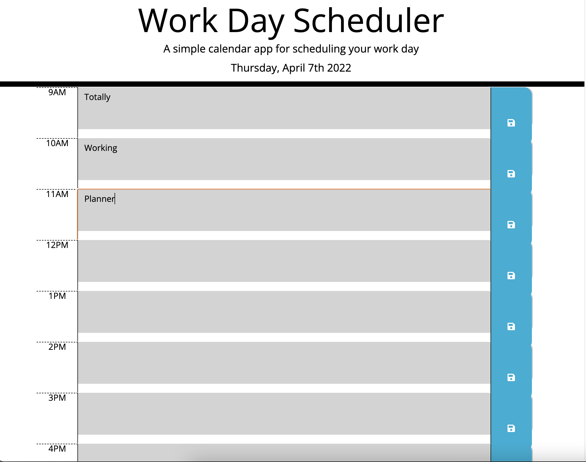

# Totally Working Planner

## Description
Welcome to the Totally Working Planner! I think the most important aspect of this is...it totally works. This project was a challenging one, at this point which one isn't? However, I learned a lot about JQuery and Moment JS while constructing this beheamoth of organization. On top of that, learning the functionality of Bootstrap has been enlightening as well!

(When I write these, I am not sure if the comedy is appreciated, but I feel it add's flavor anyways, but let me know if I should hold off :) )

Do you want to get your day on track? Do you want to stay organized beyond belief? Well you've come to the right place! Do you have something to do at 9am? Perfect! Throw it on the Totally Working Planner. How about 3pm? Bam! We got you! Got an important meeting at 1:15pm? Why not set your meeting for 1pm and be the go getter that was ready early! Here at Totally Working Planner our day is wide open, for you.

## Link

https://sammymayhem.github.io/totally-working-planner/

## Screenshot

